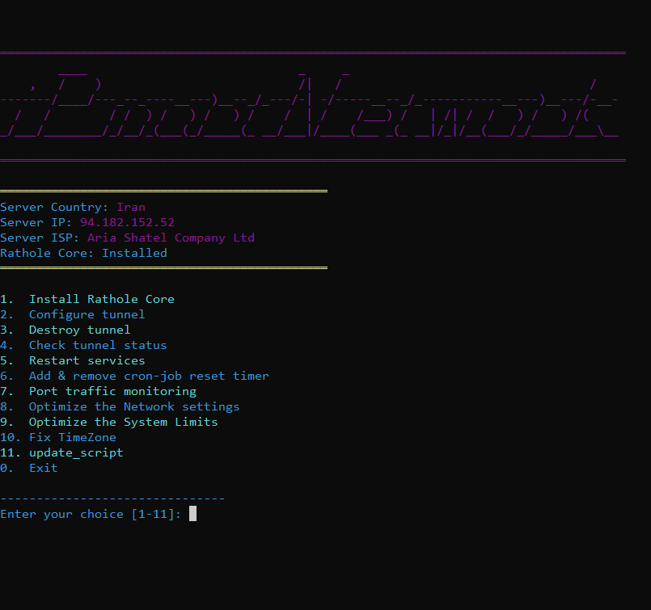

<p align="center">
<picture>

</picture>
  </p> 
<p align="center">
<h1 align="center"/>RatholeTunnel</h1>
<h6 align="center">تانل معکوس رتهول پروکسی <h6>
</p>

<p align="center">
  <a href="https://github.com/ipmartnetwork/RatholeTunnel">
    
  </a>
</p>


## پیش نیاز

اوبنتو 22 و بالاتر


## نصب

- اسکریپت را با استفاده از لینک اجرا کنید.
- هسته اصلی بطور خودکار نصب خواهد شد .
- اسکریپت را روی سرور ایران خود اجرا کنید. پورت تونل را مشخص کنید و هر تعداد پورت را که برای تنظیمات خود نیاز دارید وارد کنید.
- در اخر از طریق گزینه 6 تایمر ریست اضافه کنید.
- در سرور اصلی (خارج) مراحل مشابه سرور ایران می باشد. شما فقط باید آدرس IP سرور ایران خود را وارد کنید.
- فراموش نکنید که یک تایمر برای تنظیم مجدد سرویس در سرور اصلی اضافه کنید.
- در آپدیت جدید مصرف بهینه شده
- امکان زمانبندی دقیقه ای اضافه شد .
- نو دیلی اضافه شد ( باتشکر از موزیکسال عزیز )
- برای استفاده از امکانات جدید نسخه نهایی را نصب کنید.
- برای اپدیت اسکریپت قدیمی به جدید از گزینه 9 استفاده کنید.


## نسخه پیشنهادی


```
bash <(curl -Ls https://raw.githubusercontent.com/ipmartnetwork/RatholeTunnel/main/iPmart.sh)

```

## نسخه تست 

```
bash <(curl -Ls https://raw.githubusercontent.com/ipmartnetwork/RatholeTunnel/main/alfa.sh)

```


<p align="center">_____________________________________________________________________________________


 ## نحوه ی تانل چند سرور خارج به یک سرور ایران

در نسخه الفا امکان تانل چند سرور ایران به یک خارج و برعکس اضافه شد .


# تلگرام

[@ipmart_network](https://t.me/ipmart_network)

[@iPmart Group](https://t.me/ipmartnetwork_gp)


 # حمایت از ما :hearts:
حمایت های شما برای ما دلگرمی بزرگی است<br> 
<p align="left">
<a href="https://plisio.net/donate/kB7QU7f7" target="_blank"></a><br>
	
|                    TRX                   |                       BNB                         |                    Litecoin                       |
| ---------------------------------------- |:-------------------------------------------------:| -------------------------------------------------:|
| ```TJbTYV1fFo2485sYMyajxGPLFzxmNmPrNA``` |  ```0x4af3de9b303a8d43105e284823d95b4c600961a3``` | ```MPrkzFiNtw4Rg67bbZB6gCxa9LV87orABM``` |	

</p>	


<p align="center">
<picture>

</picture>
  </p> 


